### 01

- text as main element
- targeted usage of color

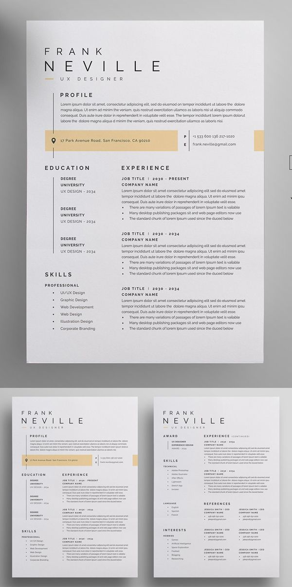

### 02

- great usage of color
- great integration of photo

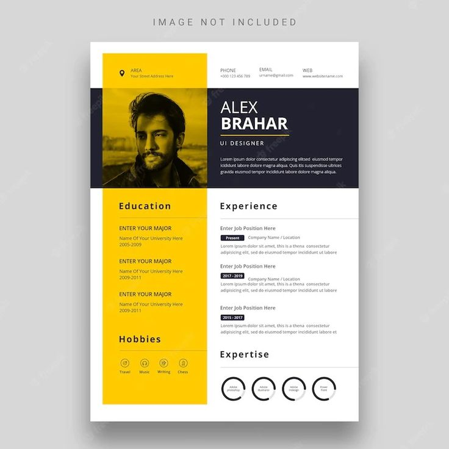

### 03

- text as main element
- very obvious hierarchy and layout

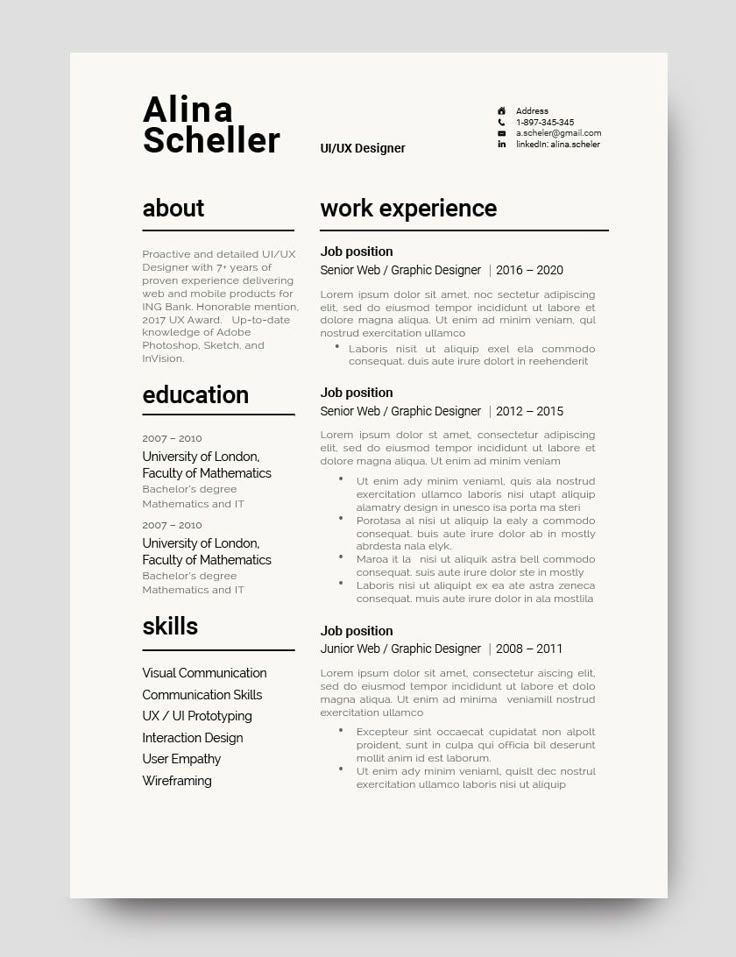

### 04

- minimalistic
- text as main element
- good usage of color
- interesting headings
- good combination of headings and underlines

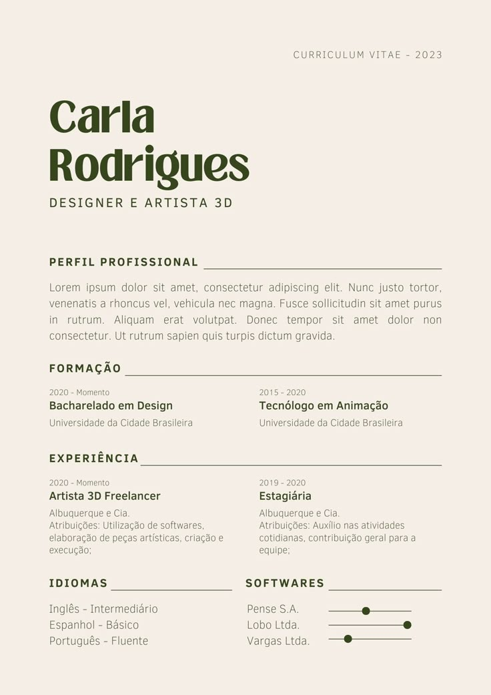

### 05

- text as main element
- close to one column layout

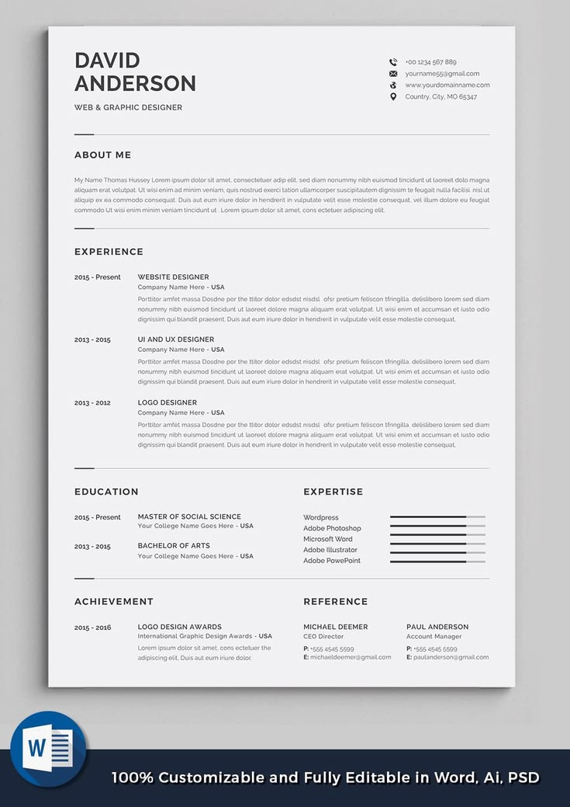

### 06

- good usage of frames

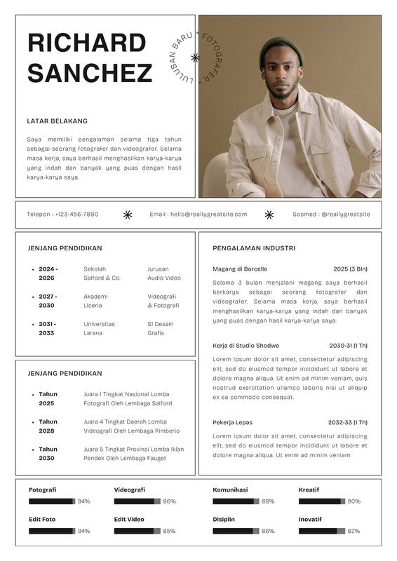

### 07

- strong intgration of photo

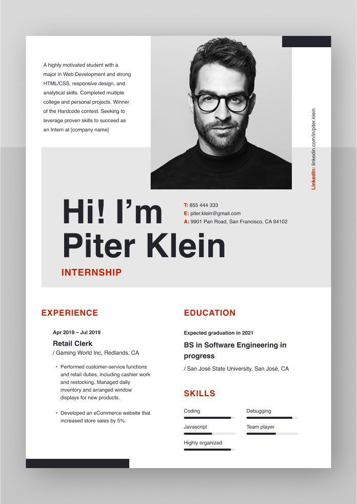

### 08

- minimalistic
- text as main element
- interesting headings
- good combination of headings and overlines
- not boring

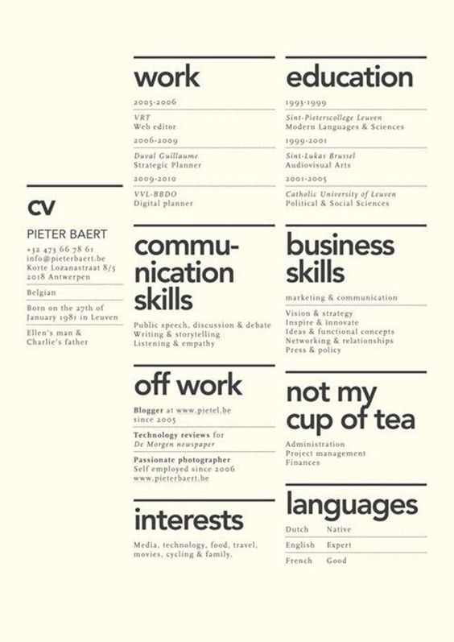

### 09

- minimalistic
- text as main element
- interesting headings
- good usage of headings
- not boring

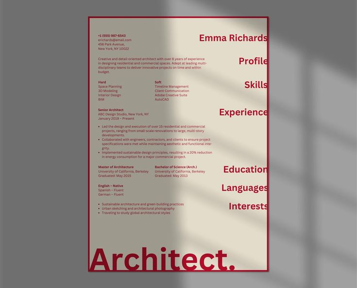

### 10

- nice integration of photo
- good hero section

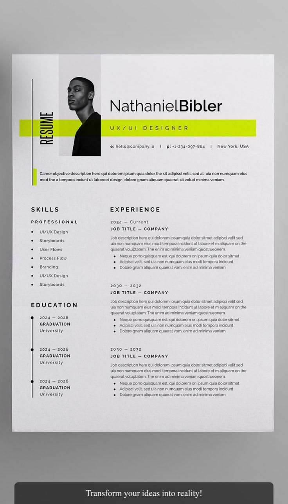

### 11

- simple but with a small color detail

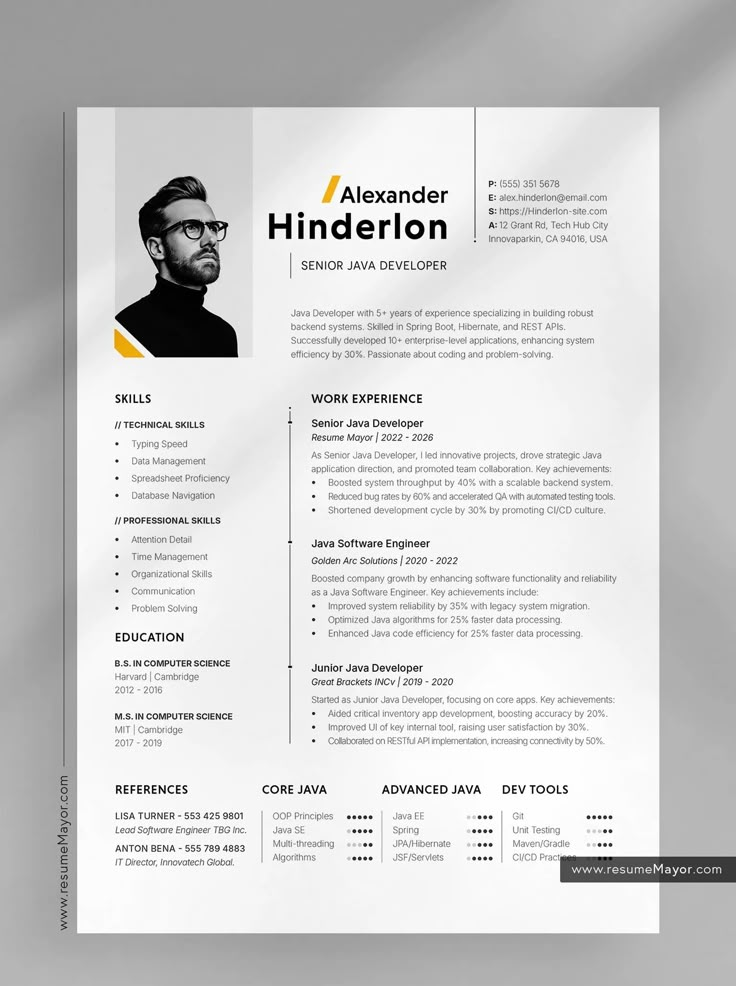

### 12

- good usage of frames
- interesting headings

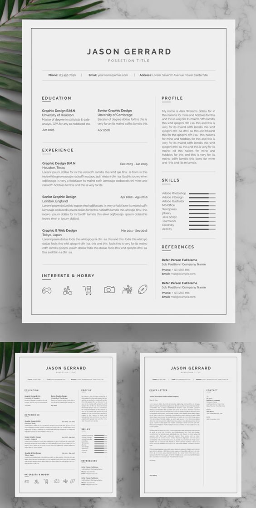